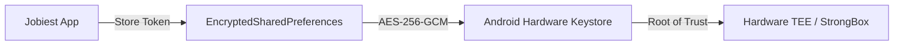

# Jobiest Native Android Security Architecture

## 1. Security Principles
The Jobiest native Android application operates under zero-trust assumptions:
1. **The Client is Untrusted**: No business entitlement, quota bypass, or role elevation logic is trusted on-device. All authorization is enforced by the PostgreSQL RLS and Next.js backend server.
2. **Zero Backend Secret Exposure**: The APK never contains database passwords, Supabase service-role keys, Vercel tokens, GitHub PATs, AI master API keys, or payment secret keys.
3. **Hardware-Backed Encryption**: Tokens are stored using Android Keystore-backed AES-256-GCM.

---

## 2. On-Device Credential Storage

### Implementation: `SecureSessionManager.kt`
- Implemented via `androidx.security.crypto.EncryptedSharedPreferences`.
- Uses `MasterKey.Builder(context).setKeyScheme(MasterKey.KeyScheme.AES256_GCM).build()`.
- **Key Encryption Scheme**: `AES256_SIV` (keys).
- **Value Encryption Scheme**: `AES256_GCM` (values).
- **Hardware Backing**: Backed by the Android hardware Keystore (TEE or StrongBox on supported chipsets).

### Backup Exclusions
- `AndroidManifest.xml` explicitly declares `android:allowBackup="false"`.
- `res/xml/data_extraction_rules.xml` excludes shared preferences from cloud backups and device-to-device transfers, ensuring access tokens never leave the physical device.

---

## 3. Network Transport Security

1. **Cleartext Traffic Disabled**:
   `android:usesCleartextTraffic="false"` is enforced in `AndroidManifest.xml`. Any unencrypted HTTP connection attempt is rejected at the OS level.
2. **TLS 1.3 / 1.2 Enforcement**:
   All communication uses TLS 1.3 with strong cipher suites via OkHttp.
3. **Sanitized Logging**:
   OkHttp `HttpLoggingInterceptor` is set to `Level.BASIC` on debug builds and `Level.NONE` on release builds. Request bodies, response bodies, and `Authorization` headers are never printed to Logcat or system traces.

---

## 4. Threat Model & Safeguards

| Threat Vector | Mitigation Strategy |
| :--- | :--- |
| **APK Decompilation / Reverse Engineering** | No backend secrets exist in the compiled DEX. ProGuard / R8 minification and obfuscation enabled. |
| **Man-in-the-Middle (MITM)** | Strict HTTPS with TLS 1.3; Android Network Security Config. |
| **Token Theft from Rooted Devices** | Hardware Keystore keys cannot be extracted in plaintext even on rooted devices with hardware-backed Keystore. |
| **Stolen/Expired Sessions** | 401 Unauthorized responses trigger automatic session invalidation and cleanup via `AuthInterceptor`. |
| **SSRF via Job URLs** | User-submitted job URLs are never parsed by client-side browser workers; workers operate in isolated server-side containers. |
